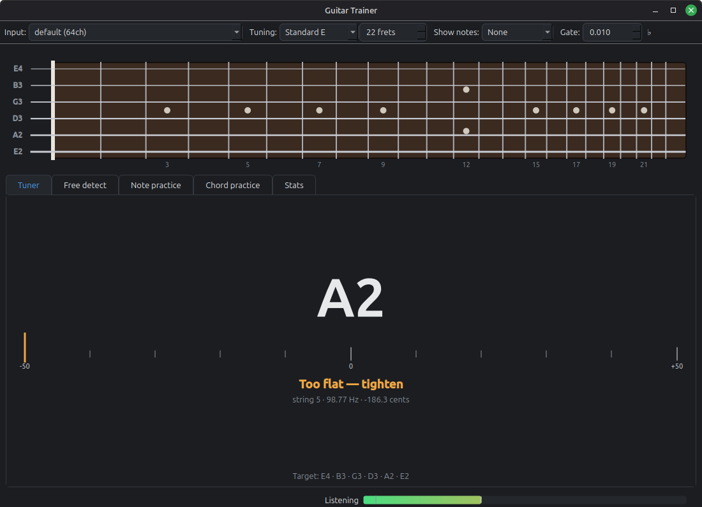

# Guitar Trainer

A desktop guitar practice app for Linux. It listens through your microphone, works out what you're
playing in real time, and drills you on notes and chords.



## Features

- **Tuner** — per-string cents readout with an in-tune indicator.
- **Free detect** — plays back what note or chord it hears, live, and lights up every matching
  position on the fretboard.
- **Fretboard map** — realistic fret spacing, with note names optionally shown (none / naturals
  only / all notes).
- **Note practice** — prompts a random note; you play it in any octave. Shows what you just
  played and what's coming up next, so you can look ahead while you practise.
- **Chord practice** — prompts a random chord from a set you configure, with the same
  previous/next preview.
- **Timing** — free mode, or rhythm mode driven by an audible metronome at a set BPM.
- **Stats** — accuracy and response times per note and chord, stored locally in SQLite.
- Settings (device, tuning, note/chord selections, tempo, ...) are remembered across runs.

## Requirements

- Python 3.10+
- PortAudio (`sudo apt install libportaudio2`)
- Qt's xcb platform plugin (`sudo apt install libxcb-cursor0`) — `run.sh` checks for
  this and offers to install it if missing
- A microphone

## Setup

```bash
git clone https://github.com/PhilipKolar/guitar-trainer.git
cd guitar-trainer
python3 -m venv .venv
.venv/bin/pip install -e ".[dev]"
```

## Running

```bash
./run.sh
```

Pick your input device from the dropdown in the toolbar and check the level meter in the status bar
responds when you play. The meter's faint vertical marker is the noise gate — set it with the
**Gate** control in the toolbar so it sits above where the room idles and below where your playing
peaks. If quiet notes are missed, lower it; if room noise triggers detection, raise it. Easiest way
to set it: click **Calibrate** and stay quiet for a second — it samples the current noise floor and
sets the gate just above it.

The **Purity** control filters out sounds that are loud enough to pass the gate but aren't a clean
instrument tone — keyboard clicks, knocks, coughs. It can't do the same for talking or singing: a
voice is genuinely harmonic, much like a plucked string, so there's no timbral trick that reliably
tells them apart. The gate (loudness) is what actually separates "played the guitar" from "said
something" — if quiet conversation near the mic is being picked up, that's a gate problem, not a
purity one.

## Development

```bash
.venv/bin/pytest                                     # full suite, no audio hardware needed
.venv/bin/python -m guitar_trainer.scripts.listen    # CLI pitch-detection smoke test
.venv/bin/python -m guitar_trainer.scripts.listen --list   # available input devices
```

All DSP tests run against synthesised signals, so the suite is deterministic and runs headless in
CI.

## How it works

Audio is captured on PortAudio's realtime thread, which does nothing but copy samples into a ring
buffer. A worker thread runs the analysis and emits results to the UI as queued Qt signals.

- **Pitch**: YIN, computed over a 4096-sample window at 48 kHz with an FFT-accelerated difference
  function and parabolic interpolation for sub-cent accuracy. A note must hold steady across several
  frames before it counts, which keeps pick attacks and fret noise from registering as notes.
- **Chords**: a chromagram is matched against templates synthesised from the harmonic series of each
  chord's tones, so recognition works across voicings rather than only the shapes it was tuned on.
- **Filtering false positives**: a frame only counts as a played note if most of its spectral energy
  sits at multiples of the detected pitch — a plucked string does this almost entirely, while a
  keyboard click or knock spreads its energy across the spectrum instead. This is what the **Purity**
  control adjusts.
- **Smoothing**: the Tuner and Free Detect meters run raw pitch estimates through a median filter
  and a light moving average before showing them, since even a clean, steady note has some
  frame-to-frame jitter. A genuine note change (switching strings) still snaps immediately rather
  than gliding through the notes in between.

## Desktop entry

To add it to the Mint application menu:

```bash
cp guitar-trainer.desktop ~/.local/share/applications/
```

Edit the `Exec` and `Path` lines first if the repository lives somewhere other than
`~/repos/guitar-trainer`.

## Licence

MIT
